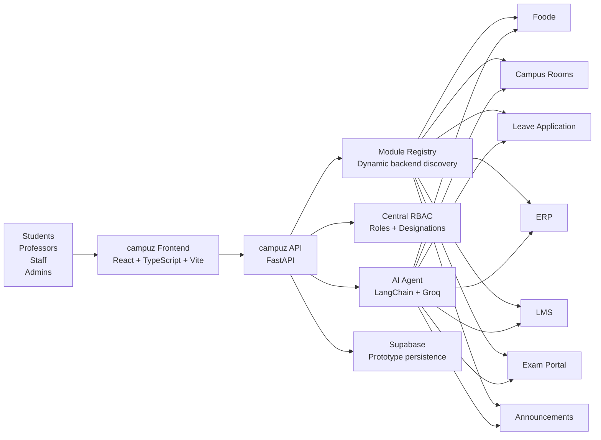
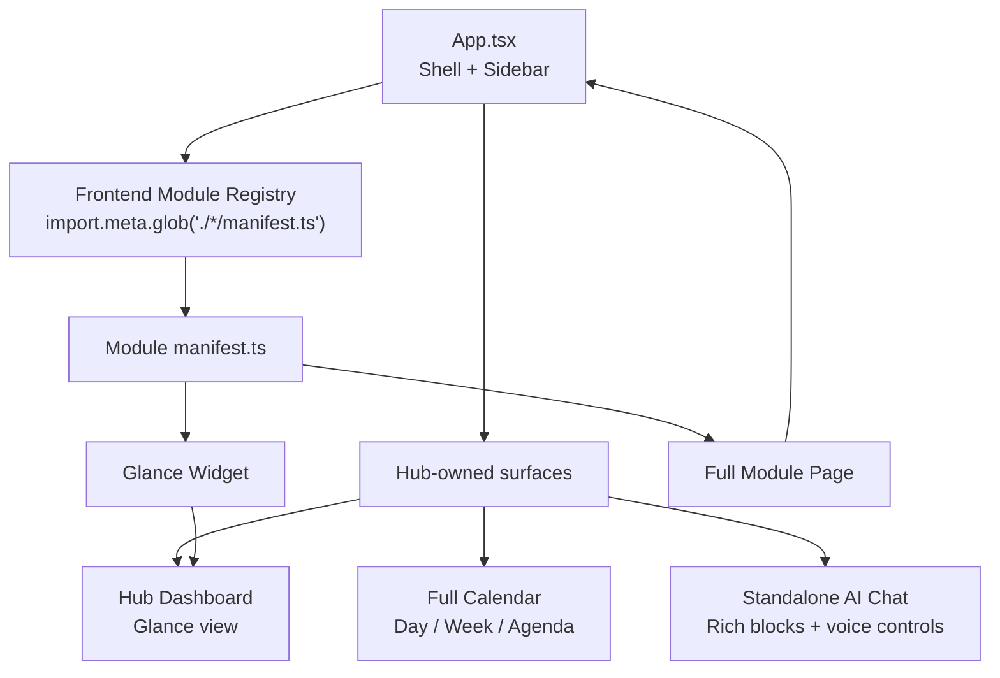
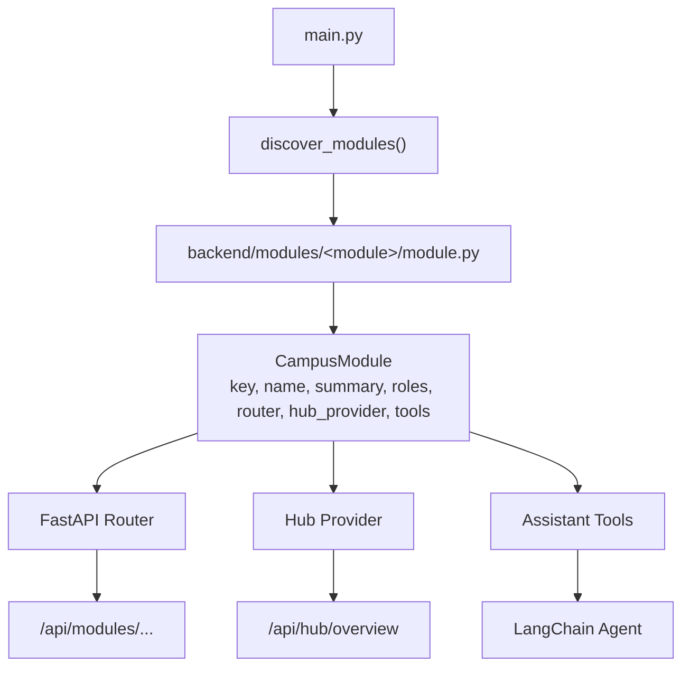
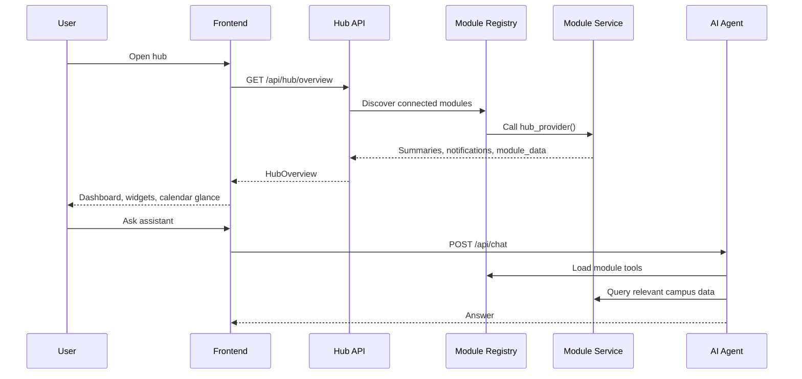
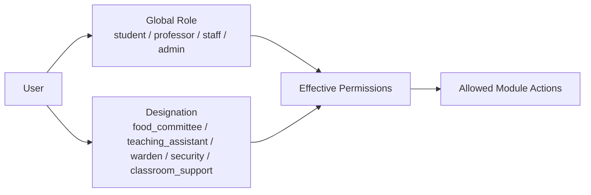
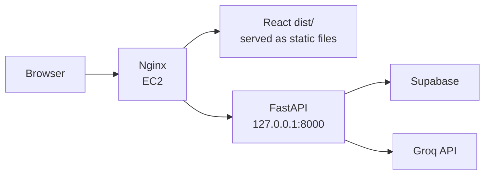

# campuz

<p align="center">
  
</p>

<p align="center">
  <strong>An AI-powered campus operating system for student life, academic workflows, and campus operations.</strong>
</p>

<p align="center">
  <a href="#architecture">Architecture</a> |
  <a href="#modules">Modules</a> |
  <a href="#quick-start">Quick Start</a> |
  <a href="#development-contract">Development Contract</a> |
  <a href="#contributors">Contributors</a>
</p>

---

## Overview

campuz is a modular campus hub built for an Amazon hackathon. It brings fragmented university systems into one consistent interface: food menus, room bookings, leave applications, ERP course registration, LMS assignments, exam schedules, announcements, personal calendar, and an AI assistant.

The product is designed around two constraints:

- **Campuses already have tools.** Each module can either use an existing website or the built-in default app.
- **Teams build in parallel.** Every campus app lives in its own frontend and backend module folder to reduce merge conflicts.

The hub stays lightweight: it shows summaries, next actions, notifications, and calendar highlights. Full workflows open inside dedicated module pages.

## Product Highlights

- **Central Hub:** Daily overview for notifications, updates, next meal, classes, assignments, quizzes, and announcements.
- **Plug-in Modules:** Foode, Campus Room Tracker, Leave Application, ERP, LMS, Exam Portal, and Announcements.
- **Role-Based Access Control:** Centralized roles plus designations such as Food Committee, TA, Warden, Security, and Classroom Support.
- **Shared Academic Catalog:** Course, professor, room, and timetable data is reused by ERP, LMS, Exam Portal, Room Tracker, Calendar, and the assistant.
- **AI Assistant:** LangChain/Groq-backed campus assistant with module tools for food, leave, rooms, academics, and announcements.
- **Professional Design System:** Screenshot-derived orange, blue, cyan, ink, white, and paper palette with the campuz logo and Amazon Ember typography assets.

## Architecture

### System Context



### Frontend Composition



### Backend Module Discovery



### Data Flow



## Modules

| Module | Key | Primary Users | Current Scope |
|---|---:|---|---|
| Hub | `hub` | All users | Dashboard, notifications, updates, daily calendar, module summaries |
| Foode | `menu` | Students, Food Committee, Admin | Weekly menu, ratings, sick meals, feedback, Excel upload, configurable source |
| Campus Room Tracker | `campus_rooms` | Students, Professors, Classroom Support, Security, Wardens | Room calendar, room/course views, booking/blocking, external website option |
| Leave Application | `campus_leave` | Students, Security, Wardens, Admin | Leave requests, history, curfew violations, guardian details, staff queues |
| ERP | `erp` | Students, Admin | Course registration with timetable conflict checks |
| LMS | `lms` | Students, Professors, TAs | Assignment deadlines and PDF submissions |
| Exam Portal | `exam_lms` | Students, Professors, TAs | Quiz windows, rooms, released/pending scores |
| Announcements | `announcements` | Students, Professors, TAs, Staff, Admin | Course/campus notices with categories, tags, filters, and priority |

## Repository Layout

```text
.
|-- backend/
|   |-- ai/                         # LangChain/Groq campus assistant
|   |-- core/                       # RBAC, module registry, shared routers
|   |-- modules/
|   |   |-- academics/              # Shared course/professor/room catalog
|   |   |-- announcements/
|   |   |-- campus_leave/
|   |   |-- campus_rooms/
|   |   |-- erp/
|   |   |-- exam_lms/
|   |   |-- hub/
|   |   |-- lms/
|   |   `-- menu/
|   |-- main.py
|   |-- requirements.txt
|   `-- schema.sql
|-- frontend/
|   |-- src/
|   |   |-- api/                    # Shared API client and fallbacks
|   |   |-- assets/                 # campuz logo, font guide, local fonts
|   |   |-- design/                 # Theme tokens and typography
|   |   |-- modules/                # Hub + plug-in campus modules
|   |   `-- types/                  # Shared TypeScript contracts
|   `-- package.json
`-- docs/                           # Architecture and module handoff docs
```

## RBAC Model

campuz separates **global roles** from **designations**.



Global roles:

- `student`
- `professor`
- `staff`
- `admin`

Designations:

- `food_committee`
- `teaching_assistant`
- `warden`
- `security`
- `classroom_support`

During the hackathon prototype, frontend requests pass access context through headers:

```text
X-User-Role: student
X-User-Designations: food_committee
```

This can later be replaced by real authentication without rewriting individual module permission checks.

## Tech Stack

| Layer | Technology |
|---|---|
| Frontend | React 18, TypeScript, Vite |
| Styling | CSS modules by feature folder, shared theme tokens, Amazon Ember fonts |
| Backend | FastAPI, Pydantic |
| AI | LangChain, LangChain Groq |
| Data | Supabase-ready schema with local preview fallbacks |
| Scheduling / HTTP | APScheduler, Requests, HTTPX |
| Deployment Shape | Static frontend + FastAPI backend behind reverse proxy |

## Quick Start

### Prerequisites

- Node.js 20+
- Python 3.10+
- npm
- A Groq API key for the AI assistant
- Supabase credentials if using live persistence

### Backend

```bash
cd backend
python3 -m venv venv
source venv/bin/activate
pip install -r requirements.txt
```

Create `backend/.env`:

```bash
SUPABASE_URL=your_supabase_url
SUPABASE_KEY=your_supabase_key
GROQ_API_KEY=your_groq_key
```

Run the API:

```bash
uvicorn main:app --reload
```

The API runs at:

```text
http://127.0.0.1:8000
```

### Frontend

```bash
cd frontend
npm install
npm run dev
```

The Vite app runs at:

```text
http://127.0.0.1:5173
```

For production builds where the backend is reverse-proxied under the same host:

```bash
VITE_API_BASE_URL=/api npm run build
```

## Verification

Frontend:

```bash
cd frontend
npm run typecheck
npm run lint
npm run build
```

Backend:

```bash
cd backend
python3 -m compileall ai core modules main.py database.py seed_db.py test_sync.py
```

## Deployment Notes

The current recommended hackathon deployment is:



Minimal production shape:

- Build the frontend with `VITE_API_BASE_URL=/api`.
- Serve `frontend/dist` through nginx.
- Proxy `/api/` to FastAPI on `127.0.0.1:8000`.
- Run the backend with `systemd`.
- Store secrets in `backend/.env` or a proper secret manager.

## Development Contract

To keep parallel module development clean:

1. Put backend code in `backend/modules/<module_key>/`.
2. Put frontend code in `frontend/src/modules/<module_key>/`.
3. Export backend modules through `module.py`.
4. Export frontend modules through `manifest.ts`.
5. Keep full workflows inside module pages.
6. Keep dashboard summaries inside module widgets and hub providers.
7. Do not create module manifests for Hub-owned surfaces such as Personal Calendar or AI Chat.
8. Shared contracts belong in `backend/core`, `frontend/src/types`, `frontend/src/api`, `frontend/src/design`, or the shared `academics` modules.

Recommended module shape:

```text
backend/modules/<module_key>/
  __init__.py
  module.py
  router.py
  schemas.py
  service.py
  tools.py

frontend/src/modules/<module_key>/
  api.ts
  manifest.ts
  types.ts
  <ModulePage>.tsx
  <ModuleGlance>.tsx
  <Module>.css
```

## Documentation

- [Implementation Plan](docs/implementation_plan.md)
- [Module Development Guide](docs/module_development_guide.md)
- [Hub-Owned Surfaces](docs/hub_surfaces.md)
- [Academic Modules](docs/academic_modules.md)
- [Campus Rooms and Leave Modules](docs/campus_rooms_leave_modules.md)
- [Menu Module Implementation](docs/menu_module_implementation.md)

## Contributors

1. **Tarun Kondapalli Srivatsa** - IIIT-Bangalore
2. **Tahir Mohammed Khadarabad** - IIIT-Bangalore

## License

This repository is currently a hackathon prototype. Add a formal license before public reuse or production distribution.
